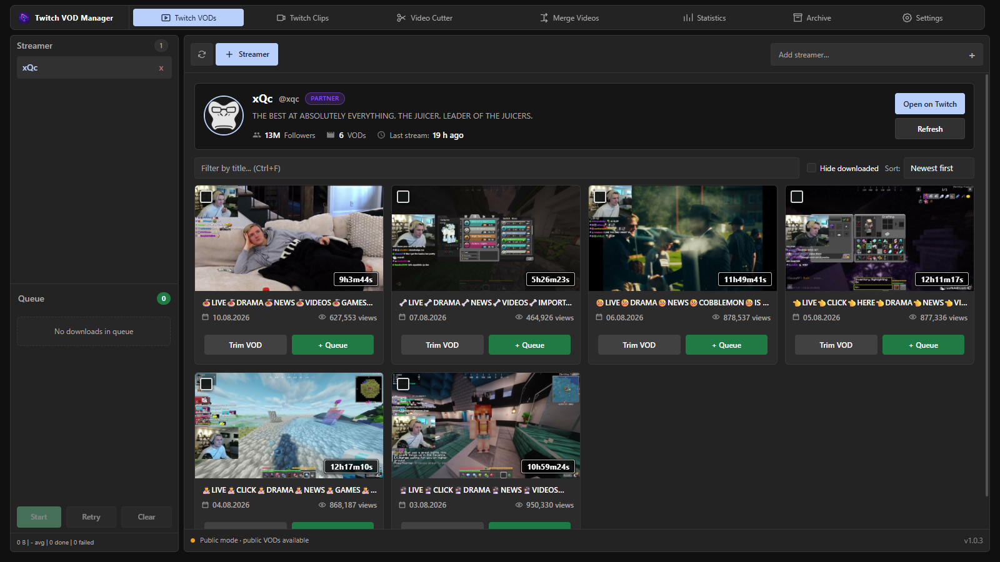

<div align="center">
  

  # Twitch VOD Manager

  A focused Windows desktop app for browsing, downloading, trimming, merging and organizing Twitch VODs and clips.

  [](https://github.com/Sucukdeluxe/Twitch-VOD-Manager/releases/latest)
  [](https://github.com/Sucukdeluxe/Twitch-VOD-Manager/releases/latest)
  [](LICENSE)

  [Download for Windows](https://github.com/Sucukdeluxe/Twitch-VOD-Manager/releases/latest)
</div>



## Overview

Twitch VOD Manager brings the complete VOD workflow into one desktop workspace. Add streamers, browse their public broadcasts, queue complete videos or precise ranges, and keep downloaded files organized without switching between separate tools.

The application works in public mode without a Twitch login. Connecting a Twitch account is optional and enables access to content available to that account, including eligible subscriber-only or channel-management VODs.

## Highlights

### Browse and organize

- Add multiple streamers and preload their profiles and VOD libraries at startup
- Refresh content quietly in the background every five minutes
- Search, sort and filter VODs with stable cards and localized metadata
- Preview high-resolution frames without leaving the application
- Track completed downloads in the archive and review aggregate statistics

### Download and process

- Download complete VODs or selected time ranges
- Edit local videos with frame-accurate trimming, removable ranges, timeline zoom, waveform guidance and undo or redo
- Split and merge recordings with dedicated tools
- Queue multiple jobs and follow real progress, speed and remaining time
- Pause and continue an active download without restarting it
- Save optional chat replays and stream events alongside recordings
- Record live streams automatically with retry and merge controls

### Desktop experience

- Compact navigation with animated selection states
- Separate settings pages for appearance, Twitch, downloads, automation, storage, maintenance, updates and diagnostics
- Light, Dark and System themes
- English and German interface languages
- Optional split Streamer and Queue sidebar
- Command palette and keyboard-friendly controls
- Integrated update checks through verified GitHub release assets

### Reliable file handling

- Active downloads are written to temporary partial files
- Final filenames appear only after a successful integrity check
- Cancelled jobs and normal application shutdowns remove incomplete files
- Stale partial files left by a crash are cleaned up on the next launch
- Application data, settings and download history remain local

## Installation

1. Open the [latest GitHub release](https://github.com/Sucukdeluxe/Twitch-VOD-Manager/releases/latest).
2. Download `Twitch-VOD-Manager-Setup-1.0.5.exe`.
3. Run the installer and choose the installation directory.
4. Start Twitch VOD Manager and add a streamer.

The current Windows installer is not code-signed, so Microsoft Defender SmartScreen may ask for confirmation before the first installation.

## Getting started

1. Select **Twitch VODs** and choose **Add streamer**.
2. Enter a Twitch channel name.
3. Select a VOD card with a click, or right-click it to open the broadcast on Twitch.
4. Choose **+ Queue** for a complete download or **Trim VOD** for a time range.
5. Review the Queue in the sidebar and start the download.

Public VODs are available immediately. Twitch authentication can be configured under **Settings → Twitch API** when account-specific access is needed.

## Data and privacy

Twitch VOD Manager stores its configuration, local database, queue state and history on the computer where it runs. OAuth credentials are handled through the local application flow and are never included in this repository or in release files.

Public mode does not require a Twitch login. It supports public VOD discovery and downloads, while authenticated access depends on the permissions of the connected Twitch account.

## Updates

The application checks GitHub Releases for newer versions. The Update control only appears when an update is actually available. Every release includes `latest.yml`, the Windows installer and its blockmap for the desktop updater.

## Development

### Requirements

- Node.js 22.13 or newer
- npm
- Windows for NSIS installer builds

### Run with hot reload

```powershell
npm ci
npm run dev
```

Renderer changes reload automatically. Main-process changes restart the development application.

### Verify and build

```powershell
npm run test:e2e:release
npm run dist:win
```

The Windows installer and updater metadata are written to `release/`.

## Project structure

| Path | Purpose |
| --- | --- |
| `src/main.ts` | Electron main process and desktop integrations |
| `src/main/` | Domain logic, persistence and infrastructure |
| `src/renderer-*.ts` | Workspace features and renderer behavior |
| `src/index.html` | Application shell and settings pages |
| `src/styles.css` | Shared component styles |
| `src/workspace.css` | Desktop workspace layout and motion |
| `scripts/` | Development, test and release checks |
| `build/` | Installer resources and application icons |

## License

Twitch VOD Manager is released under the [MIT License](LICENSE).
