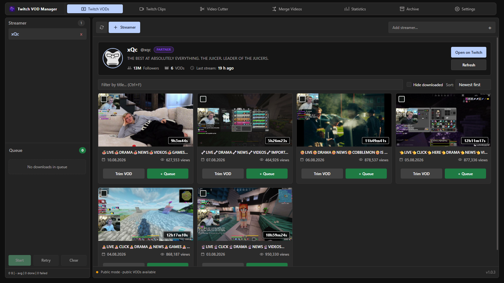

<div align="center">
  

  # Twitch VOD Manager

  A focused Windows desktop app for browsing, downloading, trimming, merging and organizing Twitch VODs and clips.

  [](https://github.com/Sucukdeluxe/Twitch-VOD-Manager/releases/latest)
  [](https://github.com/Sucukdeluxe/Twitch-VOD-Manager/releases/latest)
  [](LICENSE)

  [Download for Windows](https://github.com/Sucukdeluxe/Twitch-VOD-Manager/releases/latest)
</div>



## Overview

Twitch VOD Manager brings the complete VOD workflow into one desktop workspace. Add streamers, browse their public broadcasts, queue complete videos or precise ranges, and keep downloaded files organized without switching between separate tools.

The application works in public mode without a Twitch login. Connecting a Twitch account is optional and enables access to content available to that account, including eligible subscriber-only or channel-management VODs.

## Highlights

### Browse and organize

- Add multiple streamers and preload their profiles and VOD libraries at startup
- Refresh content quietly in the background every five minutes
- Search, sort and filter VODs with stable cards and localized metadata
- Preview high-resolution frames without leaving the application
- Track completed downloads in the archive and review aggregate statistics

### Download and process

- Download complete VODs or selected time ranges
- Edit local videos with frame-accurate trimming, removable ranges, timeline zoom, waveform guidance and undo or redo
- Split and merge recordings with dedicated tools
- Queue multiple jobs and follow real progress, speed and remaining time
- Pause and continue an active download without restarting it
- Save optional chat replays and stream events alongside recordings
- Record live streams automatically with retry and merge controls

### Desktop experience

- Compact navigation with animated selection states
- Separate settings pages for appearance, Twitch, downloads, automation, storage, maintenance, updates and diagnostics
- Light, Dark and System themes
- English and German interface languages
- Optional split Streamer and Queue sidebar
- Command palette and keyboard-friendly controls
- Integrated update checks through verified GitHub release assets

### Reliable file handling

- Active downloads are written to temporary partial files
- Final filenames appear only after a successful integrity check
- Cancelled jobs and normal application shutdowns remove incomplete files
- Stale partial files left by a crash are cleaned up on the next launch
- Application data, settings and download history remain local

## Installation

1. Open the [latest GitHub release](https://github.com/Sucukdeluxe/Twitch-VOD-Manager/releases/latest).
2. Download `Twitch-VOD-Manager-Setup-1.0.23.exe`.
3. Run the installer and choose the installation directory.
4. Start Twitch VOD Manager and add a streamer.

The current Windows installer is not code-signed, so Microsoft Defender SmartScreen may ask for confirmation before the first installation.

## Getting started

1. Select **Twitch VODs** and choose **Add streamer**.
2. Enter a Twitch channel name.
3. Select a VOD card with a click, or right-click it to open the broadcast on Twitch.
4. Choose **+ Queue** for a complete download or **Trim VOD** for a time range.
5. Review the Queue in the sidebar and start the download.

Public VODs are available immediately. Twitch authentication can be configured under **Settings → Twitch API** when account-specific access is needed.

## Data and privacy

Twitch VOD Manager stores its configuration, local database, queue state and history on the computer where it runs. OAuth credentials are handled through the local application flow and are never included in this repository or in release files.

Public mode does not require a Twitch login. It supports public VOD discovery and downloads, while authenticated access depends on the permissions of the connected Twitch account.

## Updates

The application checks GitHub Releases for newer versions. The Update control only appears when an update is actually available. Every release includes `latest.yml`, the Windows installer and its blockmap for the desktop updater.

Local **Video Cutter** uses the same playback controls as VOD trimming, with exact seeking, playback speed, volume, frame stepping, cinema mode, picture-in-picture and fullscreen. Its single timeline combines thumbnails, audio waveform, purple excerpt boundaries and red excluded ranges. Add or edit exclusions, then confirm or cancel them; export and project saving remain unavailable while an exclusion is being edited. The compact editing panel keeps start time, output length and end time together, with export options beside the player.

## Development

### Requirements

- Node.js 22.13 or newer
- npm
- Windows for NSIS installer builds

### Run with hot reload

```powershell
npm ci
npm run dev
```

Renderer changes reload automatically. Main-process changes restart the development application.

On Windows, double-click `scripts/start-development.vbs` to build and open the current development version without a terminal window. It uses the separate development data directories and exits when the application closes.

The VOD trim workspace uses the Streamrecorder player to play and seek through the complete VOD without downloading it in full. It includes fine seeking, exact timestamps, speed and volume controls, cinema mode, fullscreen and picture-in-picture. The history stays beside the player, with a full-width cut workspace below. Set the range using synchronized in/out markers on either timeline, time inputs (HH:MM:SS.mmm or seconds), or the I/O shortcuts. Zoom the lower timeline to the selection for finer adjustments and preview the selection before adding it to the queue. The history sidebar shows Twitch game chapters with cover images, time ranges and direct seeking. Hovering over the player timeline shows the category, VOD position and original broadcast date/time. Select a category to use its complete range for trimming. Title changes are shown when matching local live-recording event logs are available; the stored VOD title is displayed separately and is not treated as a historical title timeline. Filename and continuation settings are available beneath the cut timeline. Downloads preserve the selected stream quality and are remuxed into MP4 without re-encoding. The local video cutter re-encodes edited exports according to the selected export profile.

To remove multiple sections, choose **Exclude ranges** in **Trim VOD**, mark each section with I/O and select **Exclude selection**. Edit or restore exclusions individually in the list. Remaining content is joined in order and split into the selected number of minutes per part; only the final part can be shorter. The file preview shows each part's duration and original VOD ranges. Completely excluded original parts retain a gap in the numbering. Part length and exclusions are saved with the queue item. Downloads and joins preserve the source codecs; boundaries may align with HLS segments or video keyframes. Completed source ranges are retained for retry after interruption and removed when the job completes or is removed from the queue.

Project memory, test sources, fixtures and test artifacts are kept locally and are excluded from the repository. Test commands run the local checks when available and report their absence in a fresh checkout. Build, lint, security scanning and packaging remain available without local tests.

### Verify and build

```powershell
npm run test:e2e:release
npm run dist:win
```

The Windows installer and updater metadata are written to `release/`.

## Project structure

| Path | Purpose |
| --- | --- |
| `src/main.ts` | Electron main-process orchestration and desktop integrations |
| `src/main/queue/` | Queue process lifecycle and runtime coordination |
| `src/main/cutter/` | Video cutter integration surface |
| `src/main/twitch/` | Twitch authentication and provider integration |
| `src/main/updates/` | Update lifecycle coordination |
| `src/main/storage/` | Persistence integration surface |
| `src/main/domain/` | Shared domain logic and validation |
| `src/renderer-*.ts` | Workspace features and renderer behavior |
| `src/index.html` | Application shell and settings pages |
| `src/styles*.css` | Shared components, workflows and overlays |
| `src/workspace*.css` | Desktop workspace layout, motion and responsive refinements |
| `scripts/` | Development, test and release checks |
| `build/` | Installer resources and application icons |

## License

Twitch VOD Manager is released under the [MIT License](LICENSE).
